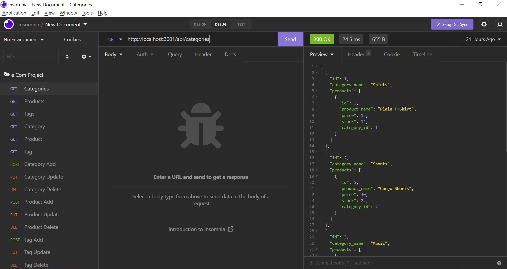

# e-Commerce Backend
 

## Description
This is a CLI application that runs an e-commerce store. It has products that belong to categories and tag names that resemble more specific categories. The application allows a person to create, read, update and delete (CRUD) categories, products and tags.

## Technologies Used
* Node.js
* Express.js
* MySQL
* MySQL2
* Sequelize
* Insomnia
* SQL
* dotenv

### Video Link
[https://drive.google.com/file/d/1oxkNIBtNjOF7QGGf9HlXVqxM3rVKG1Os/view](https://drive.google.com/file/d/1oxkNIBtNjOF7QGGf9HlXVqxM3rVKG1Os/view)

### Created by
Angel Van de Feniks
